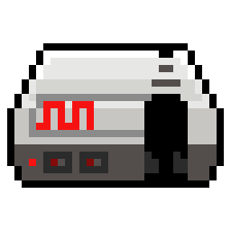

<p align="center">
    
</p>

# NSFPresenter + NSFPlayer

This repository now contains **two** related binaries built from a shared
emulator core:

- **`nsf-presenter.exe`** — the original tool: renders an NSF through the
  RusticNES emulator and encodes the piano-roll visualization + audio into
  a video file via FFmpeg.
- **`nsf-player.exe`** (new in **v0.7.0**) — a real-time, foobar2000-style
  player that plays an NSF through your speakers while showing the same
  piano-roll visualization live in a separate window. No FFmpeg
  dependency, no encoding — just playback.

Both binaries share `nsf-common` (the emulator wrapper, audio engine,
playlist + duration parsing) and the (lightly-customized) vendored
RusticNES under `external/`.

## What's new in v0.7.0

### NSFPlayer (standalone real-time player)

A separate Windows GUI application focused on listening, not encoding. Key
features:

- **Playlist pane** — add individual `.nsf` / `.nsfe` files, or recursively
  scan a folder. Each NSF's subsongs are expanded as individual playlist
  rows with track titles pulled from NSFe / accompanying M3U metadata.
- **Transport controls** — play / pause, prev / next, master volume, and a
  *Repeat playlist* checkbox.
- **Separate visualization window** opens alongside the controls. Resize
  freely, or use the **Scale: Scaled / 1x / 2x** dropdown in the toolbar to
  snap the window to exact 960×540 / 1920×1080 sizing for pixel-perfect
  display.
- **Anti-aliasing toggle (AA)** — defaults to crisp pixel-art note
  rendering by snapping note edges to integer pixels. Flip on for the
  smooth anti-aliased look the renderer uses.
- **Sub-frame visualization stepping (~240 Hz)** — the piano-roll canvas
  is snapshotted four times per NES frame so scroll looks smooth on
  high-refresh displays. Audio timing remains bit-exact at the NES's
  60.0988 Hz.
- **Wall-clock-paced audio with high-resolution Windows timer** — the
  player calls `timeBeginPeriod(1)` at startup so `thread::sleep` is
  accurate enough for jitter-free 60 Hz frame pacing.

### Workspace restructure

The source is now organized as a cargo workspace under `crates/`:

```
crates/
  nsf-common/     # shared library: emulator, audio engine, playlist, etc.
  nsf-presenter/  # video renderer + GUI + CLI (depends on ffmpeg)
  nsf-player/     # standalone real-time player (no ffmpeg dep)
```

The player binary doesn't link FFmpeg at all, so it builds much faster
than the renderer and is trivially distributable without bundled DLLs.

### Other changes

- Recent commit adds a filter graph to skip the initialization-pop noise
  at the start of rendered video output.
- RusticNES customizations: added `disable_aa` for pixel-perfect note
  edges, exposed an `update_counter` and per-scanline stepping helpers
  used by the player's sub-frame visualization.

## Installation (v0.7.0)

**Windows**:
- **`nsf-player-windows.zip`** — standalone player. Unzip and run
  `nsf-player.exe`. No external dependencies; the player does not link
  FFmpeg.
- **`nsf-presenter-windows.zip`** — video renderer with the required
  FFmpeg DLLs bundled. Unzip and run `nsf-presenter.exe`.

**Linux**: still source-only. See the original "Installation" section
below for FFmpeg/Qt6 prerequisites.

## Building from source

The repo is a cargo workspace. From the repository root:

```
# Build just the player (fast — no FFmpeg involvement):
cargo build --release -p nsf-player

# Build just the renderer:
cargo build --release -p nsf-presenter

# Build both:
cargo build --release
```

Outputs land in `target/release/nsf-player.exe` and
`target/release/nsf-presenter.exe`.

The renderer requires a working FFmpeg installation findable via
`pkg-config` or `FFMPEG_DIR`. See the original Installation notes below.

## VS Code tasks

`.vscode/tasks.json` includes:

- **Build nsf-player (release)** — `Ctrl+Shift+B`, default build task.
- **Run nsf-player** — builds + launches the player detached.
- **Build nsf-presenter (release)**.

---

# NSFPresenter (original README)

NSFPresenter is a tool I wrote to generate visualizations of my
[Dn-FamiTracker][dn-ft] covers, based on [RusticNES][rusticnes],
[FFmpeg][ffmpeg], and [Slint][slint].
You can see it in action on [my YouTube channel][yt]. I also wrote it
to learn how to write Rust.


## Functionality

NSFPresenter essentially runs your input NSF through RusticNES and
sends the piano roll window's canvas and the emulated audio to FFmpeg
to be encoded as a video.

It supports NSF modules and some features of NSF2 modules. The output
format is not very customizable (since FFmpeg is not easy to set up),
but it should work for most usecases. Support for other containers and
codecs is planned.

## Features

- Supports NSF, NSFe, and NSF2 modules.
- Supports all NSF expansion audio mappers.
- Customized version of RusticNES:
  - Added FDS audio support.
  - Slight performance enhancements for NSF playback.
- Outputs a video file:
  - Customizable resolution (default 1080p) at 60.10 FPS (the NES'/Famicom's true framerate).
  - MPEG-4 container with fast-start (`moov` atom at beginning of file).
  - Matroska (MKV) and QuickTime (MOV) containers are also supported.
  - yuv420p H.264 video stream encoded with libx264, crf: 16.
  - If using QuickTime, ProRes 4444 streams encoded with prores_ks are also supported.
  - Mono AAC LC audio stream encoded with FFmpeg's aac encoder, bitrate: 192k.
- Video files are suitable for direct upload to most websites:
  - Outputs the recommended format for YouTube, Twitter, and Discord (w/ Nitro).
  - Typical H.264 exports (1080p, up to 5 minutes) are usually below 100MB.
- Video files have metadata based on NSF metadata (title, artist, copyright, track index).
- Loop detection for FamiTracker NSF exports.
- NSFe/NSF2 features:
  - Support for extended metadata - no more 32-character limits!
  - Support for individual title/artist fields for each song in a multi-track NSF.
  - Support for NSFe duration field.
  - Support for custom VRC7 patches.
    - YM2413 (OPLL) support is planned but not yet available.
  - Support for custom mixing is planned but not yet available.

## Installation

**Windows**: head to the Releases page and grab the latest binary release. Simply unzip
             and run the executable, and you're all set.

**Linux**: no binaries yet, but you can compile from source. You'll need to have `ffmpeg`
           and optionally `Qt6` development packages installed, then clone the repo and run
           `cargo build --release` to build.

## Usage

### GUI

1. Click **Browse...** to select an input module.
2. The module's metadata, expansion chips, and supported features will
   be displayed.
3. Select a track to be rendered from the dropdown.
4. Select the duration of the output video. Available duration types are:
    - Seconds: explicit duration in seconds.
    - Frames: explicit duration in frames (1/60.1 of a second).
    - Loops: if loop detection is supported, number of loops to be played.
    - NSFe/NSF2 duration: if present, the track duration specified in the
      `time` field.
5. Select the duration of the fadeout in frames. This is not included in the
   video duration above, rather it's added on to the end.
6. Select the output video resolution. You can enter a custom resolution
   or use the 1080p/4K presets.
7. Optionally select a background for the visualization. You can select many
   common image and video formats to use as a background. 
    - You can also elect to export a transparent video later if you would like
      to use a video editor.
    - *Note:* Video backgrounds must be 60 FPS, or they will play at
      the wrong speed. A fix for this is planned.
8. Select additional rendering options:
    - Famicom mode: Emulates the Famicom's audio filter chain instead of the
      NES', which results in a slightly noisier sound.
    - High-quality filtering: Uses more accurate filter emulation for slightly
      cleaner sound at the cost of increased render time.
    - Emulate multiplexing: Accurately emulates multiplexing in mappers like
      the N163. This results in a grittier sound, which may be desirable as
      it is sometimes used for effects.
9. Click **Render!** to select the output video filename and begin rendering
   the visualization.
    - If you would like to render a transparent video for editing, then choose
      a filename ending in `.mov` to export in a QuickTime container. When asked
      if you would like to export using ProRes 4444, select **OK**.
10. Once the render is complete, you can select another track or even change
    modules to render another tune.

### CLI

If NSFPresenter is started with command line arguments, it runs in CLI mode.
This allows for the automation of rendering visualizations which in turn
allows for batch rendering and even automated uploads.

The most basic invocation is this:
```
nsf-presenter-rs path/to/music.nsf path/to/output.mp4
```

Additional options:
- `-R [rate]`: set the sample rate of the audio (default: 44100)
- `-T [track]`: select the NSF track index (default: 1)
- `-s [condition]`: select the output duration (default: `time:300`):
  - `time:[seconds]`
  - `frames:[frames]`
  - `loops:[loops]` (if supported)
  - `time:nsfe` (if supported)
- `-S [fadeout]`: select the fadeout duration in frames (default: 180).
- `--ow [width]`: select the output resolution width (default: 1920)
- `--oh [height]`: select the output resolution height (default: 1080)
- `-J`: emulate Famicom filter chain
- `-L`: use low-quality filtering
- `-X`: emulate multiplexing for mappers like the N163
- `-h`: Additional help + options
  - Note: options not listed here are unstable and may cause crashes or
    other errors.

[dn-ft]: https://github.com/Dn-Programming-Core-Management/Dn-FamiTracker
[rusticnes]: https://github.com/zeta0134/rusticnes-core
[ffmpeg]: https://github.com/FFmpeg/FFmpeg
[slint]: https://slint-ui.com
[yt]: https://youtube.com/@nununoisy
